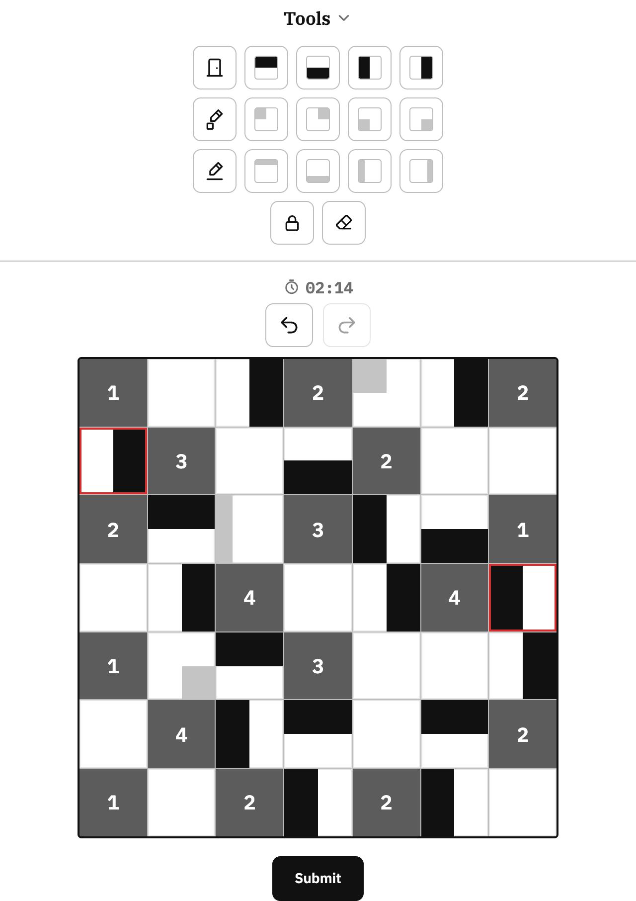

# 🚪 Room Puzzle

[한국어](README.md) | **English** | [日本語](README.ja.md)

A logic puzzle where you place black half-cell **Doors** around numbered **Rooms**.
No installation needed — play it right in your browser.

**▶ Play: https://lee-ye-eun.github.io/room-puzzle/**

<p align="center"></p>

---

## Rules

1. A cell with a number is a **Room**; a black half-cell you place is a **Door**.
2. Rooms are fixed and cannot be moved.
3. **A room's number** must equal the total **door area touching it** above, below, left, and right.
4. Every door must **touch at least one room**.
5. **Doors cannot touch other doors.**
6. Every empty cell must contain a door.
7. Gray marks are notes for solving, not doors.

### Example

A door adds area according to how much of its black part touches the room.
It counts **1** if it covers the whole side facing the room, **0.5** if it covers half of it, and **0** if it doesn't touch.

<table>
<tr>
<td align="center"></td>
<td align="center"></td>
</tr>
<tr>
<td>Room <b>4</b>: all four doors cover the whole side facing it<br>→ 1 + 1 + 1 + 1 = <b>4</b></td>
<td>Room <b>2</b>: all four doors cover only half of the side facing it<br>→ 0.5 + 0.5 + 0.5 + 0.5 = <b>2</b></td>
</tr>
</table>

### Doorknob mode


Every door gets a knob at one end of its black part.
**The numbers beside each row and above each column** give the **number of doorknobs** in that line.

Each line is half a cell wide, so every row and column has two numbers.
Click a number to gray it out once you've dealt with it.

<br clear="right">

## Controls

| Action | Effect |
| --- | --- |
| Click an empty cell | Cycle the door: Up → Down → Left → Right → Empty |
| Pick a tool, then click/drag | Place a door facing that way on one or many cells |
| Right-click · long-press | Lock/unlock a cell (right-drag to lock many at once) |
| Click a room | Fade its number, auto-filling any neighbors that have only one possible door (click again to restore the number) |
| Click a number outside the grid | Toggle gray-out |
| `Ctrl + Z` | Undo |

Gray marks (quarter-cell and strip notes) are for solving and aren't checked as part of the answer.
Locked cells have a red border.

### Keyboard shortcuts

A letter key alone picks that row's cycle tool; hold the letter and press a number to pick a specific tool.

| Key | Tool | `+ 1` | `+ 2` | `+ 3` | `+ 4` |
| --- | --- | --- | --- | --- | --- |
| `D` | Door (cycles 4 directions) | Up | Down | Left | Right |
| `F` | Quarter-cell note (cycles 4 corners) | Top-left | Top-right | Bottom-left | Bottom-right |
| `G` | Strip note (cycles 4 sides) | Top | Bottom | Left | Right |
| `L` | Lock | | | | |
| `E` | Eraser | | | | |

### Checking


When you submit, you'll see Correct! or Incorrect. If it's incorrect, **cells that break a rule turn red**.

In the example on the right, one door was flipped upside down before submitting.
The room **3** above it no longer gets enough area, and the flipped door now touches its neighboring door, so they're all marked red.

<br clear="right">

## Features

- **Puzzle sizes**: 5×5 · 7×7 · 9×9 · 15×15
- **Modes**: Standard / Doorknob
- **Tools**: directional doors, quarter-cell and strip notes, cell lock, eraser, undo/redo
- **Checking**: shows Correct! / Incorrect, and highlights rule-breaking cells in red
- **Records**: solve timer, clear count and top 5 times per mode and size
- **6 themes**: Default · Dark · Modern · Mediterranean · Rococo · Cyberpunk
- **Sound**: themed BGM (Mediterranean, Rococo, Cyberpunk) and sound effects
- **14 languages**: 한국어, English, 日本語, 简体中文, 繁體中文, Español, Français, Deutsch, Português, Русский, Italiano, Tiếng Việt, Bahasa Indonesia, ไทย
- **Mobile friendly**: touch controls, responsive layout

Settings (theme, language, sound) and records are saved in your browser's `localStorage`.

<p align="center"></p>

## Tech stack

Plain **HTML · CSS · JavaScript**, with no build tools or external libraries.

## Files

```
.
├── index.html          # the game (HTML, CSS and JS in one file)
├── audio/              # theme BGM (bgm-med / bgm-rococo / bgm-cyber, encrypted .dat)
├── tools/              # BGM encryption script (encode-audio.mjs)
└── docs/images/        # README screenshots
```

## Running locally

```bash
git clone https://github.com/lee-ye-eun/room-puzzle.git
cd room-puzzle
open index.html
```

> The BGM won't play when the file is opened directly. Serve it locally instead: run `python3 -m http.server` and open http://localhost:8000

## Deployment

The `main` branch is deployed automatically to GitHub Pages.
