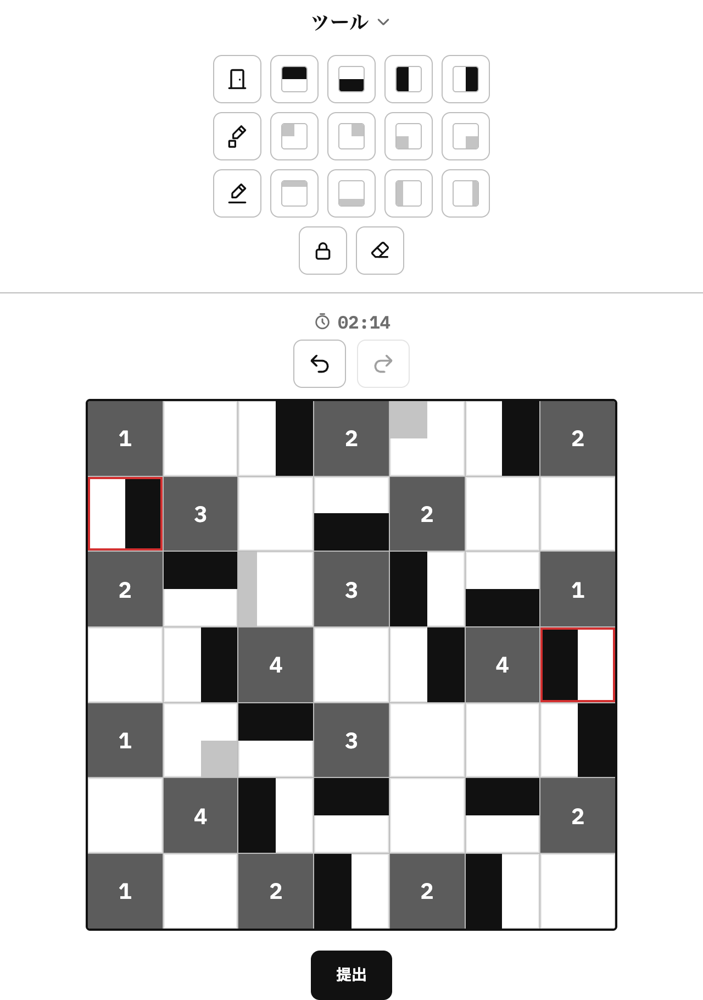
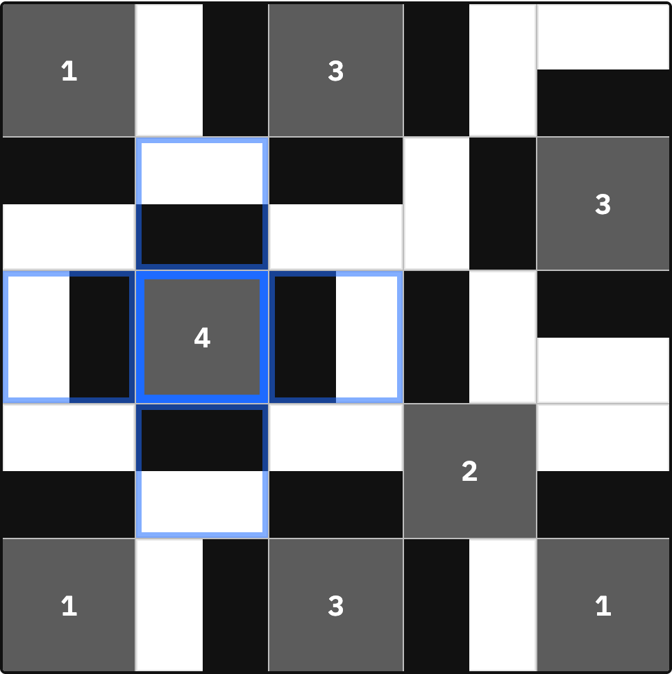
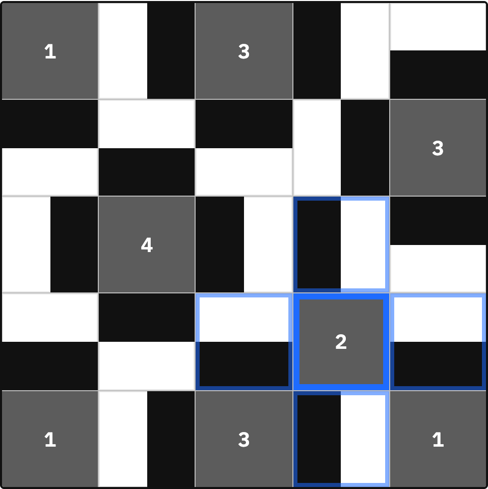
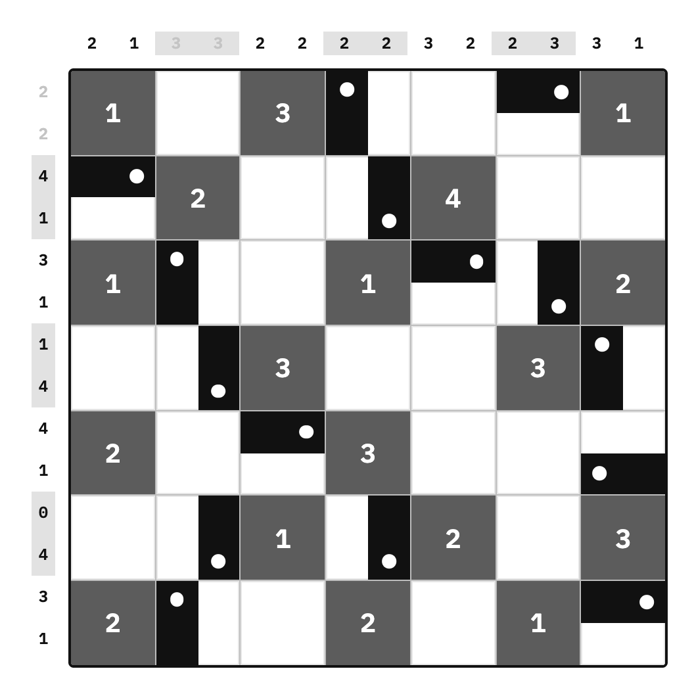
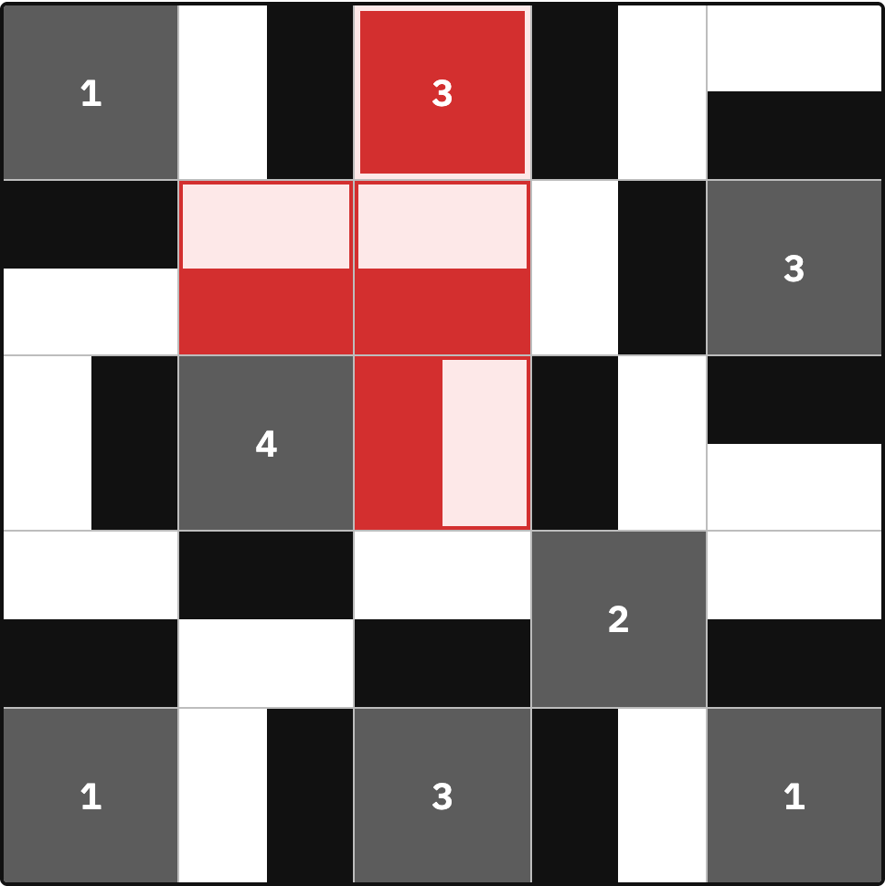
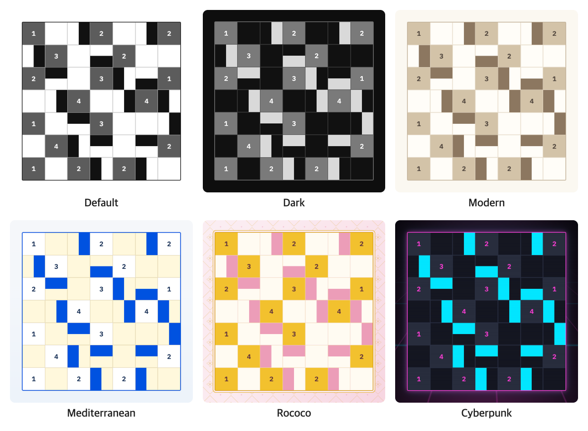

# 🚪 Room Puzzle

[한국어](README.md) | [English](README.en.md) | **日本語**

数字が書かれた**ルーム**のまわりに、黒い半マスの**ドア**を正しく配置する論理パズルゲームです。
インストール不要で、ブラウザですぐに遊べます。

**▶ プレイする: https://lee-ye-eun.github.io/room-puzzle/**

<p align="center"></p>

---

## ルール

1. 数字が書かれたマスは**ルーム**、置くことのできる黒い半マスは**ドア**です。
2. ルームの配置は変えられません。
3. **ルームの数字**は、上下左右に**接しているドアの面積**の合計と同じでなければなりません。
4. すべてのドアは、必ず**1つ以上のルームに接して**いなければなりません。
5. **ドア同士は接することができません。**
6. すべての空きマスにドアを置かなければなりません。
7. グレーのマスは解答用のメモで、ドアではありません。

### 解き方の例

ドアの黒い部分がルームに接している長さの分だけ面積が加算されます。
ルーム側の辺全体が接していれば **1**、半分だけなら **0.5**、接していなければ **0** です。

<table>
<tr>
<td align="center"></td>
<td align="center"></td>
</tr>
<tr>
<td>ルーム <b>4</b>：上下左右4つのドアがすべてルーム側の辺全体で接している<br>→ 1 + 1 + 1 + 1 = <b>4</b></td>
<td>ルーム <b>2</b>：4つのドアがすべてルーム側の辺の半分だけ接している<br>→ 0.5 + 0.5 + 0.5 + 0.5 = <b>2</b></td>
</tr>
</table>

### ドアノブモード



すべてのドアの黒い部分の片端にドアノブが付きます。
**各行の横と各列の上の数字**は、その列にある**ドアノブの数**を表します。

1マスを半分に分けた列ごとに数字があるため、各行・各列に数字が2つずつ付きます。
確認し終えた数字はクリックしてグレーにしておけます。

<br clear="right">

## 操作方法

| 操作 | 説明 |
| --- | --- |
| 空きマスをクリック | 上 → 下 → 左 → 右 → 空白の順にドアの向きが変わる |
| ツールを選んでクリック/ドラッグ | 選んだ向きのドアを1マスまたは複数マスに配置 |
| 右クリック・長押し | マスのロック/解除（右ドラッグで複数マスを一度に） |
| ルームをクリック | 数字を薄く表示し、置き方が1通りしかない隣接マスがあれば自動で埋める（もう一度クリックで数字を戻す） |
| 盤面外の数字をクリック | グレー表示の切り替え |
| `Ctrl + Z` | 元に戻す |

グレーのマス（1/4マス・線のメモ）は解答用のメモで、正誤判定には含まれません。
ロックしたマスは赤い枠で表示されます。

### ショートカットキー

文字キーだけを押すとその列の切替ツール、文字キーを押したまま数字キーを押すと個別のツールを選びます。

| キー | ツール | `+ 1` | `+ 2` | `+ 3` | `+ 4` |
| --- | --- | --- | --- | --- | --- |
| `D` | ドア（4方向切替） | 上 | 下 | 左 | 右 |
| `F` | 1/4マスメモ（4方向切替） | 左上 | 右上 | 左下 | 右下 |
| `G` | 線メモ（4方向切替） | 上 | 下 | 左 | 右 |
| `L` | ロック | | | | |
| `E` | 消しゴム | | | | |

### 判定



提出すると正解／不正解が表示され、不正解の場合は**ルールに違反したマスが赤く**表示されます。

右の画像は、ドアを1つ上下逆にして提出した例です。
上のルーム **3** は接している面積が足りず、逆にしたドアは隣のドアと接してしまうため、あわせて赤く表示されます。

<br clear="right">

## 主な機能

- **パズルのサイズ**：5×5・7×7・9×9・15×15
- **モード**：通常／ドアノブ
- **ツール**：向き別のドア、1/4マス・線のメモ、マスのロック、消しゴム、元に戻す／やり直し
- **判定**：提出時に正解／不正解を表示、不正解ならルール違反のマスを赤で強調
- **記録**：解答時間の計測、モード・サイズ別のクリア回数とベスト記録5件を保存
- **テーマ6種**：標準・ダーク・モダン・地中海・ロココ・サイバーパンク
- **サウンド**：テーマ別BGM（地中海・ロココ・サイバーパンク）と効果音
- **14言語**：한국어, English, 日本語, 简体中文, 繁體中文, Español, Français, Deutsch, Português, Русский, Italiano, Tiếng Việt, Bahasa Indonesia, ไทย
- **モバイル対応**：タッチ操作、レスポンシブレイアウト

設定（テーマ・言語・サウンド）と記録はブラウザの `localStorage` に保存されます。

<p align="center"></p>

## 技術スタック

ビルドツールや外部ライブラリを使わず、純粋な **HTML・CSS・JavaScript** で作られています。

## ファイル構成

```
.
├── index.html          # ゲーム本体（HTML・CSS・JSの単一ファイル）
├── audio/              # テーマ別BGM（bgm-med / bgm-rococo / bgm-cyber、暗号化済みの .dat）
├── tools/              # BGM暗号化スクリプト（encode-audio.mjs）
└── docs/images/        # README用スクリーンショット
```

## ローカルで実行する

```bash
git clone https://github.com/lee-ye-eun/room-puzzle.git
cd room-puzzle
open index.html
```

> ファイルを直接開くとBGMは再生されません。簡易ローカルサーバーで開いてください：`python3 -m http.server` を実行して http://localhost:8000 にアクセス

## デプロイ

`main` ブランチが GitHub Pages に自動でデプロイされます。
