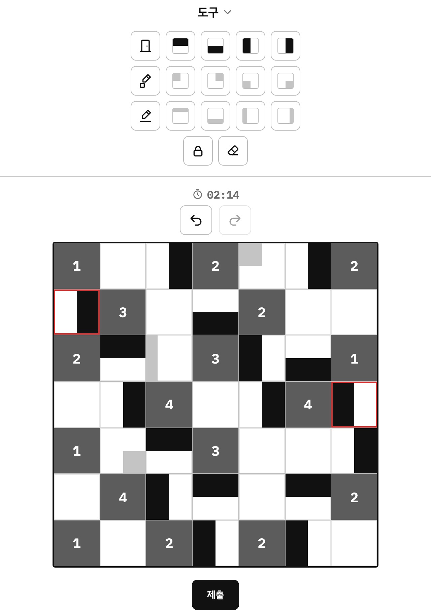

# 🚪 Room Puzzle

**한국어** | [English](README.en.md) | [日本語](README.ja.md)

숫자가 적힌 **룸** 주위에 검정 반칸 **문**을 알맞게 배치하는 논리 퍼즐 게임입니다.
설치 없이 브라우저에서 바로 즐길 수 있습니다.

**▶ 플레이하기: https://lee-ye-eun.github.io/room-puzzle/**

<p align="center"></p>

---

## 규칙

1. 숫자가 적힌 칸은 **룸**, 설치할 수 있는 검정 반칸은 **문**입니다.
2. 룸의 위치는 바꿀 수 없습니다.
3. **룸의 숫자**는 상하좌우로 **맞닿은 문의 면적**과 같아야 합니다.
4. 모든 문은 반드시 **하나 이상의 룸과 닿아** 있어야 합니다.
5. 문은 **다른 문과 닿을 수 없습니다.**
6. 모든 빈칸에는 문이 들어가야 합니다.

### 풀이 예시

문의 검정 부분이 룸과 맞닿은 길이만큼 면적이 더해집니다.
룸 쪽 변 전체가 닿으면 **1**, 절반만 닿으면 **0.5**, 닿지 않으면 **0**입니다.

<table>
<tr>
<td align="center"></td>
<td align="center"></td>
</tr>
<tr>
<td>룸 <b>4</b>: 상하좌우 네 문이 모두 룸 쪽 변 전체로 닿음<br>→ 1 + 1 + 1 + 1 = <b>4</b></td>
<td>룸 <b>2</b>: 네 문이 모두 룸 쪽 변의 절반만 닿음<br>→ 0.5 + 0.5 + 0.5 + 0.5 = <b>2</b></td>
</tr>
</table>

### 문고리 모드


문마다 검정 부분 한쪽 끝에 문고리가 달립니다.
**가로행 옆과 세로열 위의 숫자**는 그 줄에 있는 **문고리의 개수**를 뜻합니다.

한 칸을 반으로 나눈 줄마다 숫자가 있어서 행과 열마다 숫자가 두 개씩 붙습니다.
다 확인한 숫자는 클릭해서 회색으로 표시해 둘 수 있습니다.

<br clear="right">

## 조작법

| 동작 | 설명 |
| --- | --- |
| 빈칸 클릭 | 위 → 아래 → 왼쪽 → 오른쪽 → 빈칸 순서로 문 방향 변경 |
| 도구 선택 후 클릭/드래그 | 원하는 방향의 문을 한 칸 또는 여러 칸에 배치 |
| 우클릭 · 길게 누르기 | 칸 잠금/해제 (우클릭 드래그로 여러 칸 한 번에) |
| 룸 클릭 | 경우의 수가 하나뿐인 인접 칸 자동 채우기 |
| 행렬 밖 숫자 클릭 | 회색 표시 토글 |
| `Ctrl + Z` | 실행 취소 |

회색 칸(1/4칸 표시, 줄 표시)은 풀이용 메모이며 정답 판정에 포함되지 않습니다.
잠긴 칸은 빨간 테두리로 표시됩니다.

### 채점


제출하면 정답/오답이 표시되고, 오답이면 **규칙을 어긴 칸이 빨간색**으로 강조됩니다.

오른쪽은 문 하나를 위아래로 뒤집어 제출한 예시입니다.
위쪽 룸 **3**은 맞닿은 면적이 모자라고, 뒤집힌 문은 이웃한 문과 닿게 되어 함께 빨간색으로 표시됩니다.

<br clear="right">

## 주요 기능

- **퍼즐 크기**: 5×5 · 7×7 · 9×9 · 15×15
- **모드**: 기본 / 문고리
- **도구**: 방향별 문, 1/4칸·줄 메모, 칸 잠금, 지우개, 실행 취소/다시 실행
- **채점**: 제출 시 정답/오답 표시, 오답이면 규칙을 어긴 칸을 빨간색으로 강조
- **기록**: 풀이 시간 측정, 모드·크기별 클리어 횟수와 최고 기록 5개 저장
- **테마 6종**: 기본 · 다크 · 모던 · 지중해 · 로코코 · 사이버펑크
- **사운드**: 테마별 BGM(지중해·로코코·사이버펑크)과 효과음
- **14개 언어**: 한국어, English, 日本語, 简体中文, 繁體中文, Español, Français, Deutsch, Português, Русский, Italiano, Tiếng Việt, Bahasa Indonesia, ไทย
- **모바일 지원**: 터치 조작, 반응형 레이아웃

설정(테마·언어·사운드)과 기록은 브라우저의 `localStorage`에 저장됩니다.

<p align="center"></p>

## 기술 스택

빌드 도구나 외부 라이브러리 없이 순수 **HTML · CSS · JavaScript**로 만들었습니다.

## 파일 구성

```
.
├── index.html          # 게임 본체 (HTML·CSS·JS 단일 파일)
├── index-solver.html   # 솔버·생성 과정 확인용 실험 페이지
├── audio/              # 테마별 BGM (bgm-med / bgm-rococo / bgm-cyber, 암호화된 .dat)
├── tools/              # BGM 암호화 스크립트 (encode-audio.mjs)
└── docs/images/        # README 스크린샷
```

## 로컬에서 실행하기

```bash
git clone https://github.com/lee-ye-eun/room-puzzle.git
cd room-puzzle
open index.html
```

> BGM은 파일을 직접 열면 재생되지 않습니다. 로컬 서버로 여세요: `python3 -m http.server` 실행 후 http://localhost:8000 접속

## 배포

`main` 브랜치가 GitHub Pages로 자동 배포됩니다.
